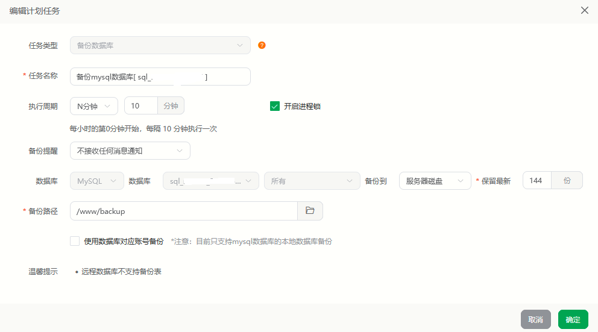
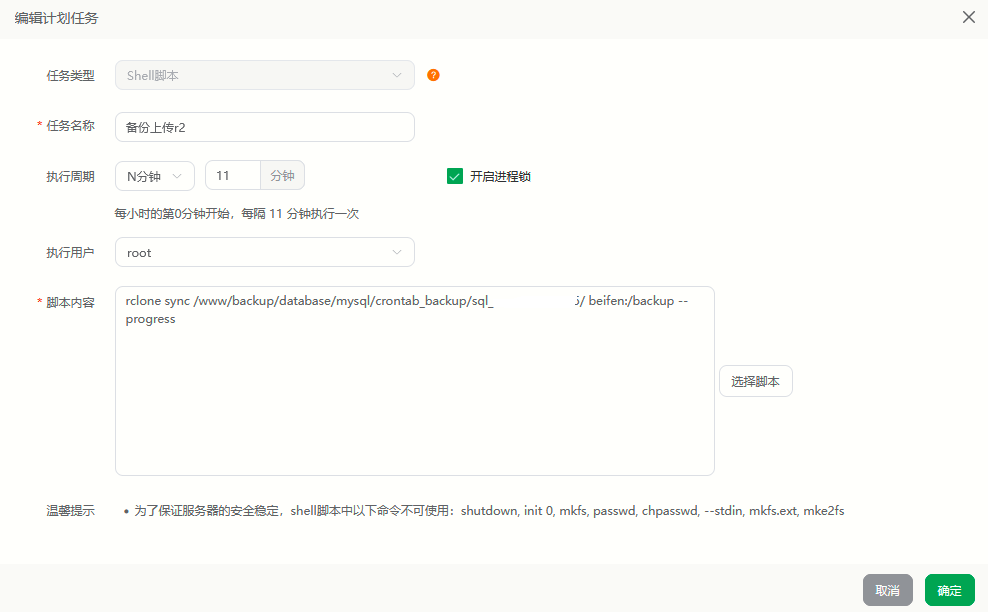

## 创建 Cloudflare R2 对象存储 的 API令牌

首先在Cloudflare账号选择左侧栏里的“R2 对象存储”

第一次使用需要绑定信用卡

概述——API——管理API令牌——创建API令牌

权限选择“管理员读和写”，然后创建

创建后自行保存显示的所有内容，或者暂时不要关闭这个网页，之后要用

<br>

## 使用rclone快速对接Cloudflare R2 存储桶

您可以通过以下命令一键下载并执行安装脚本：

```bash
wget -N https://raw.githubusercontent.com/lisi-123/rclone/main/rclone_cloudflare.sh && bash ./rclone_cloudflare.sh

```
根据提示填入创建API令牌时 展示的内容

<br><br>


## 添加宝塔计划任务

工作原理：

第一步自动备份数据库到本地

第二步把本地自动备份的数据库通过rclone上传到cf的r2对象存储

已经做过本地备份的直接看第二步

<br>

### 1.数据库本地定时备份

宝塔面板-计划任务-数据库备份



具体备份频率和保留的备份数量根据需求自行修改

备份数据库的总量不要超过10g就行

比如我的数据库备份文件才5mb，保留144份也才720mb

数据库较大的话，可以降低备份频率，减少备份数量

新添加了备份数据库的计划任务后，记得点一下执行，保证至少有一个数据库备份文件

<br>

### 2.数据库上传cf的r2存储桶

宝塔面板-计划任务-shell脚本

执行用户选择root（没有则不选），脚本内容填写以下内容，“数据库名称”改为自己的数据库名称



```bash
rclone sync /www/backup/database/mysql/crontab_backup/数据库名称/ beifen:/backup --progress
```

宝塔面板的默认数据库备份路径为“/www/backup/database/mysql/crontab_backup/数据库名称/”

建议在宝塔面板的“文件”那里打开这个路径验证一下

如果数据库备份文件不在该路径，请自行寻找对应路径并替换

计划任务添加后，手动点一下执行，执行后去cf的r2存储桶那边看到一个名为backup的文件夹，且里面有数据库备份文件就算成功

<br>

## 计费问题

Cloudflare R2 对象存储 目前免费套餐包括：

免费10g的储存空间

每月1g下载和无限制的上传

每月免费 1 万次 API 请求


我们主要使用免费的上传功能，所以放心绑定信用卡，几乎不可能扣费

<br>


